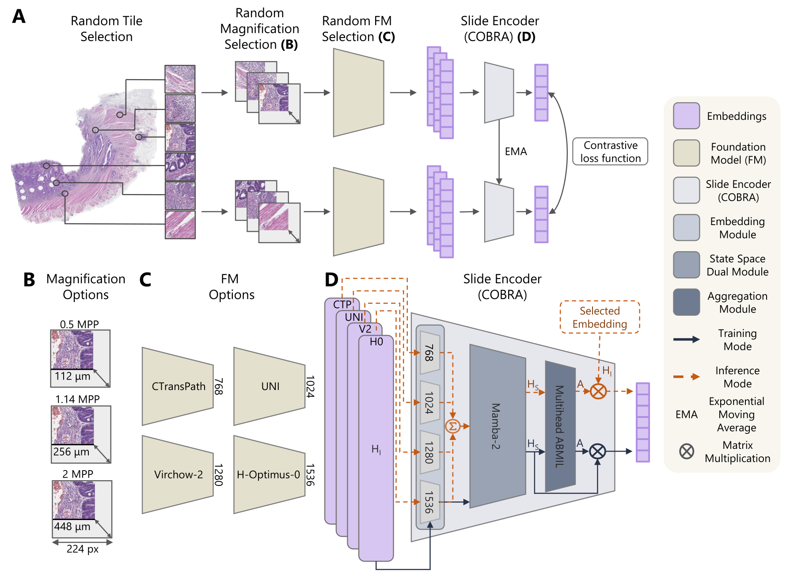

# COntrastive Biomarker Representation Alignment (COBRA)


<!-- [Preprint](https://arxiv.org/abs/2411.13623) | [Download Models](https://huggingface.co/KatherLab/COBRA) | [Cite](#citation) -->
<a href='https://arxiv.org/abs/2411.13623'></a> 
<a href='#citation'></a>
<a href='https://huggingface.co/KatherLab/COBRA'></a>

## Table of Contents

- [Abstract](#abstract)
- [News](#news)
- [Installation](#installation)
- [Feature Extraction](#feature-extraction)
- [Crossvalidation](#crossvalidation)
- [Heatmaps](#generating-heatmaps)
- [Pretraining](#pretraining)
- [References](#references)
- [Citation](#citation)

## Abstract


> Representation learning of pathology whole-slide images (WSIs) has primarily relied on weak supervision with Multiple Instance Learning (MIL). This approach leads to slide representations highly tailored to a specific clinical task. Self-supervised learning (SSL) has been successfully applied to train histopathology foundation models (FMs) for patch embedding generation. However, generating patient or slide level embeddings remains challenging. Existing approaches for slide representation learning extend the principles of SSL from patch level learning to entire slides by aligning different augmentations of the slide or by utilizing multimodal data. By integrating tile embeddings from multiple FMs, we propose a new single modality SSL method in feature space that generates useful slide representations. Our contrastive pretraining strategy, called COBRA, employs multiple FMs and an architecture based on Mamba-2. COBRA exceeds performance of state-of-the-art slide encoders on several public cohorts by at least +4.4% AUC, despite only being pretrained on a limited set of WSIs. Additionally, COBRA is readily compatible at inference time with previously unseen feature extractors.

<p align="center">
  
</p>

## News
- **[Feb 27th 2025]** Our [paper](https://arxiv.org/abs/2411.13623) has been accepted to [CVPR 2025](https://cvpr.thecvf.com/Conferences/2025/AcceptedPapers)! 🎉
- **[Feb 7th 2025]**: [COBRA II](https://huggingface.co/KatherLab/COBRA) trained on all TCGA cohorts, is now live and ready to use!!

## Installation

To install the necessary dependencies, run the following commands:

```bash
git clone https://github.com/KatherLab/COBRA.git && cd COBRA
pip install uv
uv venv --python=3.11
source .venv/bin/activate
uv pip install torch==2.4.1 setuptools packaging wheel numpy==2.0.0
uv sync --no-build-isolation
```

If there are any **issues**, consider also installing hatchling and editables:


```bash
uv pip install hatchling editables
```

And make sure python3.11-devel (or python3.11-dev) is installed. For Fedora or derivatives:

```bash
dnf install python3.11-devel
```

For Debian or derivatives:

```bash
apt install python3.11-dev
```

## Feature extraction

To deploy the COBRA model to extract WSI-level or even patient-level embeddings, follow these steps:

1. **Prepare your data**: Extract tile embeddings with one or more patch encoders of your choice using [STAMP](https://github.com/KatherLab/STAMP).  
    - **COBRA I:**
      - Supported tissue types: LUAD, LUSC, STAD, CRC, BRCA
      - Supported patch encoders to generate weighting: CTransPath, UNI, Virchow2, H_optimus_0
      - Supported patch encoders for patch feature aggregation: all existing patch encoders
    - **COBRA II:**
      - Supported tissue types: all tissue types included in TCGA
      - Supported patch encoders to generate COBRAII weighting: CONCH, UNI, Virchow2, H_optimus_0
      - Supported patch encoders for patch feature aggregation: all existing patch encoders

2. **Request Access** on [Huggingface](https://huggingface.co/KatherLab/COBRA).

3. **Extract COBRA Features**:  
   The extraction scripts allow you to obtain slide‑ or patient‑level embeddings. In addition to standard command‑line arguments, you can now supply a YAML configuration file (using the `--config` flag) which overrides or specifies all extraction parameters (such as input directories, checkpoint paths, top‑k selection, etc.).

   **Example configuration (extract_feats_config.yml):**

   ```yaml
   extract_feats:
    download_model: false
    checkpoint_path: "/path/to/checkpoint.pth.tar"
    top_k: null
    output_dir: "/path/to/extracted/output"
    feat_dir: "/path/to/tile_embeddings"
    feat_dir_a: "/path/to/tile_embeddings_aux"  # Optional, for aggregation features
    model_name: "COBRAII"
    patch_encoder: "Virchow2"
    patch_encoder_a: "Virchow2"
    h5_name: "cobra_feats.h5"
    microns: 224
    use_cobraI: false # wheter to use cobraI or cobraII
    slide_table: "/path/to/slide_table.csv"  # Provide for patient-level extraction, omit for slide-level
   ```

   **Usage:**

   - **Slide-level extraction** (without a slide table):

     ```bash
     python -m cobra.inference.extract_feats --feat_dir "/path/to/tile_embeddings" --output_dir "/path/to/slide_embeddings" --checkpoint_path "/path/to/checkpoint.pth.tar"
     ```

     Or by providing a configuration file:

     ```bash
     python -m cobra.inference.extract_feats --config /path/to/extract_feats_config.yml
     ```

   - **Patient-level extraction** (using a slide table):

     ```bash
     python -m cobra.inference.extract_feats --feat_dir "/path/to/tile_embeddings" --output_dir "/path/to/patient_embeddings" --slide_table "/path/to/slide_table.csv" --checkpoint_path "/path/to/checkpoint.pth.tar"
     ```

     Or with configuration:

     ```bash
     python -m cobra.inference.extract_feats --config /path/to/extract_feats_config.yml
     ```

   > *Note:* You have the option of providing different directories for weighting and aggregation steps. The script will load primary features from `--feat_dir` and, if provided, additional features from `--feat_dir_a`. Features are matched by their coordinates before aggregation.

## Crossvalidation

After extracting the COBRA features (either at the slide or patient level), you can run crossvalidation to train and evaluate a downstream MLP classifier. The crossvalidation workflow is managed by two main scripts.

### 1. Training with Crossvalidation

The `cobra/crossval/train.py` script performs stratified K-fold crossvalidation and saves test predictions, AUROC scores, and the best model checkpoints per fold.  
You need to supply a configuration file that specifies the following:
- **CSV/Excel metadata file** with patient IDs and target values.
- **H5 file** with extracted features.
- **Output folder** for saving checkpoints and results.
- **Hyperparameters** for training (learning rate, hidden dimension, batch size, number of folds, etc.).

**Example configuration (crossval.yml):**

```yaml
train:
  csv_path: "/path/to/metadata.csv"
  target_column: "TARGET"
  patient_id_column: "PATIENT_ID"
  h5_path: "/path/to/extracted_features.h5"
  output_folder: "/path/to/crossval/results"
  hps:
    lr: 0.0005
    hidden_dim: 512
    max_epochs: 64
    patience: 16
    batch_size: 32
    num_workers: 8
    n_folds: 5
    dropout: 0.3

deploy:
  csv_path: "/path/to/test_metadata.csv"
  target_column: "TARGET"
  patient_id_column: "PATIENT_ID"
  h5_path: "/path/to/extracted_features.h5"
  output_folder: "/path/to/deploy/results"
  label_encoder_path: "/path/to/label_encoder.pkl"
  hps:
    hidden_dim: 512
    n_folds: 5
```

**Usage:**

Train with:

```bash
python -m cobra.crossval.train -c /path/to/crossval.yml
```

During training, the script:
- Loads the CSV metadata and matches patient IDs with those in the H5 file.
- Encodes the target labels and saves the encoder.
- Splits data using Stratified K-Fold.
- Trains the MLP with PyTorch Lightning (using early stopping and checkpoint callbacks).
- Evaluates each fold and saves detailed results (including per-patient predictions and AUROC scores).

### 2. Deployment and Evaluation

The corresponding deployment script (`cobra/crossval/deploy.py`) lets you evaluate a trained model on unseen data. Its configuration file should include:
- CSV metadata file with test targets.
- H5 file with features used during inference.
- Path to the saved label encoder from training.
- Output folder for saving summaries and predictions.

**Usage:**

```bash
python -m cobra.crossval.deploy -c /path/to/crossval.yml
```

This script loads the best checkpoints from training, matches test patient IDs with the H5 file, computes evaluation metrics (e.g., AUROC), and saves both per-fold and aggregated results.

> *Note:* Use your crossvalidation configuration file to supply all necessary file paths and hyperparameters.

## Generating Heatmaps

The `cobra/inference/heatmaps.py` script generates visual heatmaps of WSIs by overlaying model attention maps.

### How It Works
- Reads tile feature files (HDF5) and corresponding WSIs.
- Computes attention values from the COBRA model.
- Creates a composite image combining the slide thumbnail and a heatmap.
- Adds a 2 mm scale bar for reference.
- Saves the final composite as a PDF.

### Example Configuration (heatmap_config.yml)

```yaml
heatmap:
  feat_dir: "/path/to/tile_embeddings"       # Directory for tile feature files (HDF5)
  wsi_dir: "/path/to/wsi_files"                # Directory for whole slide images
  checkpoint_path: "/path/to/checkpoint.pth.tar"  # Model checkpoint path
  microns: 112                               # Microns per patch used for extraction
  patch_size: 224                            # Size of each patch in pixels
  output_dir: "/path/to/heatmap/output"        # Where to save generated heatmaps
  stamp_version: 2                           # Stamp version used during extraction
```

### Usage

- With a configuration file:

```bash
python -m cobra.inference.heatmaps -c /path/to/heatmap_config.yml
```

- Or via command-line arguments:

```bash
python -m cobra.inference.heatmaps \
    -f "/path/to/tile_embeddings" \
    -s "/path/to/wsi_files" \
    -w "/path/to/checkpoint.pth.tar" \
    -r 112 \
    -p 224 \
    -o "/path/to/heatmap/output" \
    -v 2
```

## Pretraining

COBRA is pretrained with constrastive self-supervised learning based on [MoCo-v3](https://github.com/facebookresearch/moco-v3).
The code to pretrain COBRA is explained in the following.

### What It Does
- Pretrains a COBRA-based model using tile-level features.
- Uses a YAML configuration to specify model parameters, data paths, and training hyperparameters.
- Saves pretrained weights for later use in feature extraction and downstream tasks.

### Example Configuration (cobraII.yml)

```yaml
model:
  nr_heads: 4
  nr_mamba_layers: 1
  dim: 768
  input_dims:
    - 512
    - 1024
    - 1280
    - 1536
  l_dim: 256
  att_dim: 256
  dropout: 0.2
  d_state: 128
  model_name: "cobraII"

ssl:
  moco_m: 0.99
  moco_t: 0.2
  lr: 5e-4
  warmup_epochs: 50
  weight_decay: 0.1
  epochs: 2000
  workers: 56
  batch_size: 1024

general:
  nr_feats: 768
  fms:
    - "fm1"
    - "fm2"
    - "fm3"
    - "fm4"
  feat_base_paths:
    - "/path/to/features_set1"
    - "/path/to/features_set2"
  paths:
    out_dir: "/path/to/pretrain/output"
```

### Usage

```bash
python -m cobra.ssl.pretrain -c /path/to/config.yml
```

This script sets up the SSL pretraining using your specified configuration and trains the model on tile features.

## References

- [CTransPath](https://github.com/Xiyue-Wang/TransPath)  
- [UNI](https://github.com/mahmoodlab/uni)  
- [Virchow2](https://huggingface.co/paige-ai/Virchow2)  
- [H-Optimus-0](https://github.com/bioptimus/releases/tree/main/models/h-optimus/v0)  
- [CONCH](https://github.com/mahmoodlab/CONCH)  
- [STAMP](https://github.com/KatherLab/STAMP)  
- [MoCo-v3](https://github.com/facebookresearch/moco-v3)

## Citation

If you find our work useful in your research or if you use parts of this code please consider citing our paper:

```bibtex
@InProceedings{COBRA_2025_CVPR,
    author    = {Lenz, Tim* and Neidlinger, Peter* and Ligero, Marta and W\"olflein, Georg and van Treeck, Marko and Kather, Jakob N.},
    title     = {Unsupervised Foundation Model-Agnostic Slide-Level Representation Learning},
    booktitle = {Proceedings of the Computer Vision and Pattern Recognition Conference (CVPR)},
    month     = {June},
    year      = {2025},
    pages     = {30807-30817}
}
```
